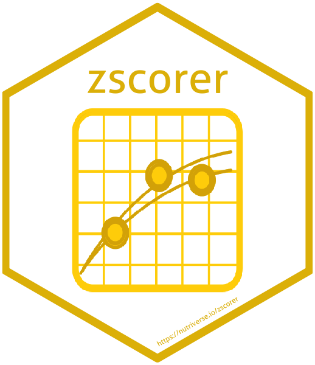

<!-- README.md is generated from README.Rmd. Please edit that file -->

```{r, echo = FALSE}
knitr::opts_chunk$set(
  collapse = TRUE,
  comment = "#>",
  fig.path = "README-"
)
```

# zscorer: Weight-for-age, height-for-age and weight-for-height z-score calculator 

[](http://www.repostatus.org/#active)
[](https://cran.r-project.org/package=zscorer)
[](https://CRAN.R-project.org/package=bbw)
[](https://CRAN.R-project.org/package=bbw)
[](https://travis-ci.org/nutriverse/zscorer)
[](https://ci.appveyor.com/project/nutriverse/zscorer)
[](https://codecov.io/gh/nutriverse/zscorer)

`zscorer` facilitates the calculation of `z-scores` (i.e. the number of standard
deviations from the mean) for the three key anthropometric indices used to assess
early childhood growth: `weight-for-age (WFA)`, `height-for-age (HFA)` and
`weight-for-height (WFH)`. `zscorer` refers to the results of the **WHO Multicentre
Growth Reference Study** as standard for calculating the `z-scores` hence it comes
packaged with this reference data.

`zscorer` can be used to calculate the appropriate `z-score` for the corresponding
anthropometric index for a single child to assess growth and nutritional status 
against the standard. It can also be used to calculate the `z-scores` for an 
entire cohort or sample of children (such as in nutrition surveys) to allow for 
assessing the nutritional status of the entire child population.

## Installation

You can install `zscorer` from GitHub with:

```{r gh-installation1, eval = FALSE}
# install.packages("devtools")
devtools::install_github("nutriverse/zscorer")
```
```{r gh-installation2, eval = TRUE}
# load package
library(zscorer)
```

## Usage

### Calculating z-score for each of the three anthropometric indices for a single child

For this example, we will use the `getWGS()` function and apply it to dummy data 
of a **52 month** old male child with a weight of **14.6 kg** and a height of 
**98.0 cm**.

```{r example1, eval = TRUE}
# weight-for-age z-score
waz <- getWGS(sexObserved = 1,     # 1 = Male / 2 = Female
              firstPart = 14.6,    # Weight in kilograms up to 1 decimal place
              secondPart = 52,     # Age in whole months
              index = "wfa")       # Anthropometric index (weight-for-age)

waz

# height-for-age z-score
haz <- getWGS(sexObserved = 1,
              firstPart = 98,      # Height in centimetres
              secondPart = 52,
              index = "hfa")       # Anthropometric index (height-for-age)

haz

# weight-for-height z-score
whz <- getWGS(sexObserved = 1,
              firstPart = 14.6,
              secondPart = 98,
              index = "wfh")       # Anthropometric index (weight-for-height)

whz
```

Applying the `getWGS()` function results in a calculated `z-score` for one child.


### Calculating z-score for each of the three anthropometric indices for a cohort or sample of children

For this example, we will use the `getCohortWGS()` function and apply it to sample 
data `anthro1` that came with `zscorer`.

```{r sample-data1, eval = FALSE}
# Make a call for the anthro1 dataset
anthro1
```

As you will see, this dataset has the 4 variables you will need to use with
`getCohortWGS()` to calculate the `z-score` for the corresponding anthropometric
index. These are `age`, `sex`, `weight` and `height`.

```{r, echo = FALSE, eval = TRUE}
library(zscorer)
```

```{r sample-data2, eval = TRUE}
head(anthro1)
```

To calculate the three anthropometric indices for all the children in the sample, 
we execute the following commands in R:

```{r example2, eval = TRUE}
# weight-for-age z-score
waz <- getCohortWGS(data = anthro1,
                    sexObserved = "sex",
                    firstPart = "weight",
                    secondPart = "age",
                    index = "wfa")
head(waz, 100)

# height-for-age z-score
haz <- getCohortWGS(data = anthro1,
                    sexObserved = "sex",
                    firstPart = "height",
                    secondPart = "age",
                    index = "hfa")
head(haz, 100)

# weight-for-height z-score
whz <- getCohortWGS(data = anthro1,
                    sexObserved = "sex",
                    firstPart = "weight",
                    secondPart = "height",
                    index = "wfh")
head(whz, 100)
```

Applying the `getCohortWGS()` function results in a vector of calculated `z-scores`
for all children in the cohort or sample.

### Calculating z-scores for all of the three anthropometric indices in one function

For this example, we will use the `getAllWGS()` function and apply it to sample 
data `anthro1` that came with `zscorer`.

```{r example3, eval = TRUE}
# weight-for-age z-score
zScores <- getAllWGS(data = anthro1,
                     sex = "sex",
                     weight = "weight",
                     height = "height",
                     age = "age",
                     index = "all")
head(zScores, 100)
```

Applying the `getAllWGS()` function results in a data frame of calculated `z-scores`
for all children in the cohort or sample for all the anthropometric indices.
