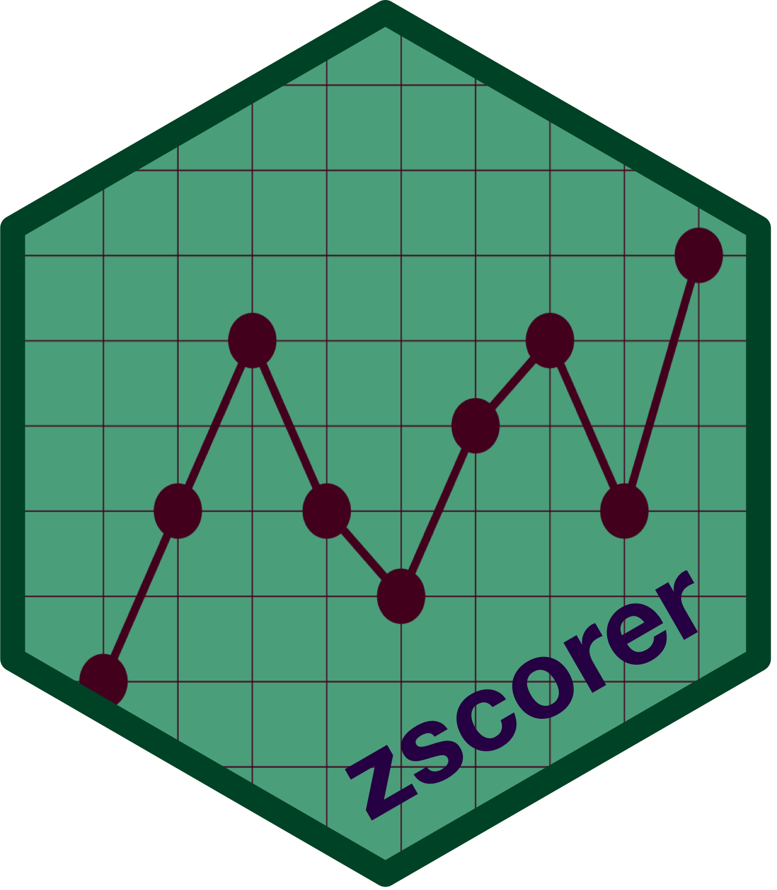

<!-- README.md is generated from README.Rmd. Please edit that file -->

```{r, echo = FALSE}
knitr::opts_chunk$set(
  message = FALSE,
  warning = FALSE,
  collapse = TRUE,
  comment = "#>",
  fig.path = "man/figures/README-")
```

# zscorer: Anthropometric Z-Score Calculator 

<!-- badges: start -->
[](http://www.repostatus.org/#active)
[](https://www.tidyverse.org/lifecycle/#maturing)
[](https://cran.r-project.org/package=zscorer)
[](https://CRAN.R-project.org/package=zscorer)
[](https://CRAN.R-project.org/package=zscorer)
[](https://CRAN.R-project.org/package=zscorer)
[](https://github.com/nutriverse/zscorer/actions/workflows/R-CMD-check.yaml)
[](https://github.com/nutriverse/zscorer/actions)
[](https://codecov.io/gh/nutriverse/zscorer?branch=master)
[](https://zenodo.org/badge/latestdoi/119683584)
[](https://www.codefactor.io/repository/github/nutriverse/zscorer)
<!-- badges: end -->

Nutritional status, especially in children, has been widely assessed using anthropometric measures in both developing and developed countries. Once a childs' anthropometry has been correctly measured and their age has been recorded, their growth and nutritional status can be assessed using a standardised age- and sex-specific growth reference to calculate z-scores. These z-scores express anthropometric measurements as several standard deviations (SDs) below or above the reference mean or median value. The calculation of anthropometric z-scores is one of the most widely-used analytical technique used in nutrition surveys and nutrition research.

## What does `zscorer` do?

The `zscorer` packages facilitates the calculation of a range of anthropometric *z-scores* (i.e. the number of standard deviations from the mean) and adds them to survey data:

* **Weight-for-length (wfl)** z-scores for children with lengths between 45 and 110 cm

* **Weight-for-height (wfh)** z-scores for children with heights between 65 and 120 cm

* **Length-for-age (lfa)** z-scores for children aged less than 24 months

* **Height-for-age (hfa)** z-scores for children aged between 24 and 228 months

* **Weight-for-age (wfa)** z-scores for children aged between zero and 120 months

* **Body mass index-for-age (bfa)** z-scores for children aged between zero and 228 months

* **MUAC-for-age (mfa)** z-scores for children aged between 3 and 228 months

* **Triceps skinfold-for-age (tsa)** z-scores for children aged between 3 and 60 months

* **Sub-scapular skinfold-for-age (ssa)** z-scores for children aged between 3 and 60 months

* **Head circumference-for-age (hca)** z-scores for children aged between zero and 60 months

The *z-scores* are calculated using the **WHO Child Growth Standards**<sup>1,2</sup> for children aged between zero and 60 months or the **WHO Growth References**<sup>3</sup> for school-aged children and adolescents. MUAC-for-age (mfa) z-scores for children aged between 60 and 228 months are calculated using the MUAC-for-age growth reference developed by Mramba et al. (2017)<sup>4</sup> using data from the USA and Africa. This reference has been validated with African school-age children and adolescents. The `zscorer` comes packaged with the WHO Growth References data and the MUAC-for-age reference data.

## Installation

You can install `zscorer` from [CRAN](https://cran.r-project.org):
```{r gh-installation1, eval = FALSE}
install.packages("zscorer")
```

or you can install the development version of `zscorer` from [GitHub](https://github.com/nutriverse/zscorer) with:

```{r gh-installation2, eval = FALSE}
if(!require(remotes)) install.packages("remotes")
remotes::install_github("nutriverse/zscorer")
```

then load `zscorer`

```{r gh-installation3, eval = TRUE}
# load package
library(zscorer)
```

## Usage - WHO Growth Standards functions

### Calculating anthropometric z-scores using the addWGSR() function

The main function in the `zscorer` package is `addWGSR`.

To demonstrate its usage, we will use the accompanying dataset in `zscorer` called `anthro3`. We inspect the dataset as follows:

```{r usage1, echo = TRUE, eval = FALSE}
head(anthro3)
```

which returns:

```{r usage1a, echo = FALSE, eval = TRUE}
head(anthro3)
```

`anthro3` contains anthropometric data from a Rapid Assessment Method (RAM) survey from Burundi.

Anthropometric indices (e.g. weight-for-height z-scores) have not been calculated and added to the data.

We will use the `addWGSR` function to add weight-for-height (wfh) z-scores to the example data:

```{r usage2, echo = TRUE, eval = TRUE}
svy <- addWGSR(data = anthro3, sex = "sex", firstPart = "weight",
               secondPart = "height", index = "wfh")
```

A new column named **wfhz** has been added to the dataset:

```{r usage2a, echo = FALSE, eval = TRUE}
head(svy)
```

The `wfhz` column contains the weight-for-height (wfh) z-scores calculated from the `sex`, `weight`, and `height` columns in the `anthro3` dataset. The calculated z-scores are rounded to two decimals places unless the `digits` option is used to specify a different precision (run `?addWGSR` to see description of various parameters that can be specified in the `addWGSR` function). 

The `addWGSR` function takes up to nine parameters to calculate each index separately, depending on the index required. These are described in the *Help* files of the `zscorer` package which can be accessed as follows:

```{r usage2b, echo = TRUE, eval = FALSE}
?addWGSR
```

The **standing** parameter specifies how “stature” (i.e. length or height) was measured. If this is not specified, and in some special circumstances, height and age rules will be applied when calculating z-scores. These rules are described in the table below.

&nbsp;

+---------------+---------------+---------------+---------------+----------------------------------------+
| **index**     | **standing**  | **age**       | **height**    | **Action**                             |
+===============+===============+===============+===============+========================================+
| hfa or lfa    | standing      | < 731 days    |               | index = lfa                            |
|               |               |               |               | height = height + 0.7 cm               |
+---------------+---------------+---------------+---------------+----------------------------------------+
| hfa or lfa    | supine        | < 731 days    |               | index = lfa                            |
+---------------+---------------+---------------+---------------+----------------------------------------+
| hfa or lfa    | unknown       | < 731 days    |               | index = lfa                            |
+---------------+---------------+---------------+---------------+----------------------------------------+
| hfa or lfa    | standing      | ≥ 731 days    |               | index = hfa                            |
+---------------+---------------+---------------+---------------+----------------------------------------+
| hfa or lfa    | supine        | ≥ 731 days    |               | index = hfa                            |
|               |               |               |               | height = height - 0.7 cm               |
+---------------+---------------+---------------+---------------+----------------------------------------+
| hfa or lfa    | unknown       | ≥ 731 days    |               | index = hfa                            |
+---------------+---------------+---------------+---------------+----------------------------------------+
| wfh or wfl    | standing      |               | < 65 cm       | index = wfl                            |
|               |               |               |               | height = height + 0.7 cm               |
+---------------+---------------+---------------+---------------+----------------------------------------+
| wfh or wfl    | standing      |               | ≥ 65 cm       | index = wfh                            |
+---------------+---------------+---------------+---------------+----------------------------------------+
| wfh or wfl    | supine        |               | ≤ 110 cm      | index = wfl                            |
+---------------+---------------+---------------+---------------+----------------------------------------+
| wfh or wfl    | supine        |               | more than     | index = wfh                            |
|               |               |               | 110 cm        | height = height - 0.7 cm               |
+---------------+---------------+---------------+---------------+----------------------------------------+
| wfh or wfl    | unknown       |               | < 87 cm       | index = wfl                            |
+---------------+---------------+---------------+---------------+----------------------------------------+
| wfh or wfl    | unknown       |               | ≥ 87 cm       | index = wfh                            |
+---------------+---------------+---------------+---------------+----------------------------------------+
| bfa           | standing      | < 731 days    |               | height = height + 0.7 cm               |
+---------------+---------------+---------------+---------------+----------------------------------------+
| bfa           | standing      | ≥ 731 days    |               | height = height - 0.7 cm               |
+---------------+---------------+---------------+---------------+----------------------------------------+

&nbsp;


The `addWGSR()` function will not produce error messages unless there is something very wrong with the data or the specified parameters. If an error is encountered in a record then the value **NA** is returned. Error conditions are listed in the table below. 

&nbsp;

+--------------------------------------------------+----------------------------------------+
| **Error condition**                              | **Action**                             |
+==================================================+========================================+
| Missing or nonsense value in `standing` parameter| Set `standing` to `3` (unknown) and    | 
|                                                  | apply appropriate height or age rules. |
+--------------------------------------------------+----------------------------------------+
| Unknown `index` specified                        | Return **NA** for z-score.             |
+--------------------------------------------------+----------------------------------------+
| Missing `sex`                                    | Return **NA** for z-score.             |
+--------------------------------------------------+----------------------------------------+
| Missing `firstPart`                              | Return **NA** for z-score.             |
+--------------------------------------------------+----------------------------------------+
| Missing `secondPart`                             | Return **NA** for z-score.             |
+--------------------------------------------------+----------------------------------------+
| `sex` is not male (`1`) or female (`2`)          | Return **NA** for z-score.             |
+--------------------------------------------------+----------------------------------------+
| `firstPart` is not numeric                       | Return **NA** for z-score.             |
+--------------------------------------------------+----------------------------------------+
| `secondPart` is not numeric                      | Return **NA** for z-score.             |
+--------------------------------------------------+----------------------------------------+
| Missing `thirdPart` when `index = "bfa"`         | Return **NA** for z-score.             |
+--------------------------------------------------+----------------------------------------+
| `thirdPart` is not numeric when `index = "bfa"`  | Return **NA** for z-score.             |
+--------------------------------------------------+----------------------------------------+
| `secondPart` is out of range for specified index | Return **NA** for z-score.             |
+--------------------------------------------------+----------------------------------------+
 
&nbsp;

We can see this error behaviour using the example data:

```{r usage3, echo = TRUE, eval = TRUE}
table(is.na(svy$wfhz))
```

We can display the problem record:

```{r usage4, echo = TRUE, eval = TRUE}
svy[is.na(svy$wfhz), ]
```

The problem is due to the value **9** in the `sex` column, which should be coded **1** (for male) and **2** (for female). Z-scores are only calculated for records with sex specified as either **1** (male) or **2** (female). All other values, including **NA**, will return **NA**.

The `addWGSR()` function requires that data are recorded using the required units or required codes (see `?addWGSR` to check units required by the different function parameters).

The `addWGSR()` function will return incorrect values if the data are not recorded using the required units. For example, this attempt to add weight-for-age z-scores to the example data:

```{r usage5, echo = TRUE, eval = TRUE}
svy <- addWGSR(data = svy, sex = "sex", firstPart = "weight", 
               secondPart = "age", index = "wfa")
```
	
will give incorrect results:

```{r usage5a, echo = TRUE, eval = TRUE}
summary(svy$wfaz)
```

The odd range of values is due to age being recorded in months rather than days.

It is simple to convert all ages from months to days:

```{r usage5b, echo = TRUE, eval = TRUE}
svy$age <- svy$age * (365.25 / 12)
head(svy)
```

before calculating and adding weight-for-age z-scores:

```{r usage5c, echo = TRUE, eval = TRUE}
svy <- addWGSR(data = svy, sex = "sex", firstPart = "weight", 
               secondPart = "age", index = "wfa")
head(svy)
summary(svy$wfaz)
```

The muac column in the example dataset is recorded in millimetres (mm). We need to convert this to centimetres (cm): 

```{r usage6, echo = TRUE, eval = TRUE}
svy$muac <- svy$muac / 10
head(svy)
```

before using the `addWGS()` function to calculate MUAC-for-age z-scores:

```{r usage6a, echo = TRUE, eval = TRUE}
svy <- addWGSR(svy, sex = "sex", firstPart = "muac",	
               secondPart = "age", index = "mfa")
head(svy)
```

As a last example we will use the `addWGSR()` function to add body mass index-for-age (bfa) z-scores to the data to create a new variable called bmiAgeZ with a precision of 4 decimal places as:

```{r usage7, echo = TRUE, eval = TRUE}
svy <- addWGSR(data = svy, sex = "sex", firstPart = "weight", 
               secondPart = "height", thirdPart = "age", index = "bfa", 
               output = "bmiAgeZ", digits = 4)
head(svy)
```

## Usage - legacy functions

To maintain support for earlier versions of the package, the earlier functions used to calculate anthropometric z-scores for `weight-for-age`, `height-for-age` and `weight-for-height` still work but will be removed (defunct) in the next version of `zscorer`. For current and new users, it is recommended to use `addWGSR()` and `getWGSR()` functions instead.

### Calculating z-score for each of the three anthropometric indices for a single child

For this example, we will use the `getWGS()` function and apply it to dummy data 
of a **52 month** old male child with a weight of **14.6 kg** and a height of 
**98.0 cm**.

```{r example1, eval = TRUE}
# weight-for-age z-score
waz <- getWGS(sexObserved = 1,     # 1 = Male / 2 = Female
              firstPart = 14.6,    # Weight in kilograms up to 1 decimal place
              secondPart = 52,     # Age in whole months
              index = "wfa")       # Anthropometric index (weight-for-age)

waz

# height-for-age z-score
haz <- getWGS(sexObserved = 1,
              firstPart = 98,      # Height in centimetres
              secondPart = 52,
              index = "hfa")       # Anthropometric index (height-for-age)

haz

# weight-for-height z-score
whz <- getWGS(sexObserved = 1,
              firstPart = 14.6,
              secondPart = 98,
              index = "wfh")       # Anthropometric index (weight-for-height)

whz
```

Applying the `getWGS()` function results in a calculated `z-score` for one child.


### Calculating z-score for each of the three anthropometric indices for a cohort or sample of children

For this example, we will use the `getCohortWGS()` function and apply it to sample 
data `anthro1` that came with `zscorer`.

```{r sample-data1, eval = FALSE}
# Make a call for the anthro1 dataset
anthro1
```

As you will see, this dataset has the 4 variables you will need to use with
`getCohortWGS()` to calculate the `z-score` for the corresponding anthropometric
index. These are `age`, `sex`, `weight` and `height`.

```{r, echo = FALSE, eval = TRUE}
library(zscorer)
```

```{r sample-data2, eval = TRUE}
head(anthro1)
```

To calculate the three anthropometric indices for all the children in the sample, 
we execute the following commands in R:

```{r example2, eval = TRUE}
# weight-for-age z-score
waz <- getCohortWGS(data = anthro1,
                    sexObserved = "sex",
                    firstPart = "weight",
                    secondPart = "age",
                    index = "wfa")
head(waz, 50)

# height-for-age z-score
haz <- getCohortWGS(data = anthro1,
                    sexObserved = "sex",
                    firstPart = "height",
                    secondPart = "age",
                    index = "hfa")
head(haz, 50)

# weight-for-height z-score
whz <- getCohortWGS(data = anthro1,
                    sexObserved = "sex",
                    firstPart = "weight",
                    secondPart = "height",
                    index = "wfh")
head(whz, 50)
```

Applying the `getCohortWGS()` function results in a vector of calculated `z-scores`
for all children in the cohort or sample.

### Calculating z-scores for all of the three anthropometric indices in one function

For this example, we will use the `getAllWGS()` function and apply it to sample 
data `anthro1` that came with `zscorer`.

```{r example3, eval = TRUE}
# weight-for-age z-score
zScores <- getAllWGS(data = anthro1,
                     sex = "sex",
                     weight = "weight",
                     height = "height",
                     age = "age",
                     index = "all")
head(zScores, 20)
```

Applying the `getAllWGS()` function results in a data frame of calculated `z-scores`
for all children in the cohort or sample for all the anthropometric indices.

## Usage of CDC 2000 Growth Standards functions

### Calculate z-scores


## Shiny app

To use the included Shiny app, run the following command in R:

```{r, echo = TRUE, eval = FALSE}
run_zscorer()
```

This will initiate the Shiny app using the installed web browser in your current device as shown below:

```{r, echo = FALSE, eval = TRUE}

```

## Citation

If you find the `zscorer` package useful please cite using the suggested citation provided by a call to the `citation` function as follows:

```{r citation}
citation("zscorer")
```

## Community guidelines

Feedback, bug reports and feature requests are welcome; file issues or seek support [here](https://github.com/nutriverse/zscorer/issues). If you would like to contribute to the package, please see our [contributing guidelines](https://nutriverse.io/zscorer/CONTRIBUTING.html).

This project is released with a [Contributor Code of Conduct](https://nutriverse/zscorer/CODE_OF_CONDUCT.html). By participating in this project you agree to abide by its terms.

## References

<sup>1</sup> World Health Organization. (2006). WHO child growth standards : length/height-for-age, weight-for-age, weight-for-length, weight -for-height and body mass index-for-age : methods and development. World Health Organization. [https://apps.who.int/iris/handle/10665/43413](https://apps.who.int/iris/handle/10665/43413)

<sup>2</sup> World Health Organization. (2007). WHO child growth standards : head circumference-for-age, arm circumference-for-age, triceps skinfold-for-age and subscapular skinfold-for-age : methods and development. World Health Organization. [https://apps.who.int/iris/handle/10665/43706](https://apps.who.int/iris/handle/10665/43706)

<sup>3</sup> de Onis M. Development of a WHO growth reference for school-aged children and adolescents. Bull World Health Org. 2007;85: 660–667. [doi:10.2471/BLT.07.043497](https://doi.org/10.2471/blt.07.043497)

<sup>4</sup> Mramba L, Ngari M, Mwangome M, Muchai L, Bauni E, Walker AS, et al. A growth reference for mid upper arm circumference for age among school age children and adolescents, and validation for mortality: growth curve construction and longitudinal cohort study. BMJ. 2017;: j3423–8. [doi:10.1136/bmj.j3423](https://doi.org/10.1136/bmj.j3423)


