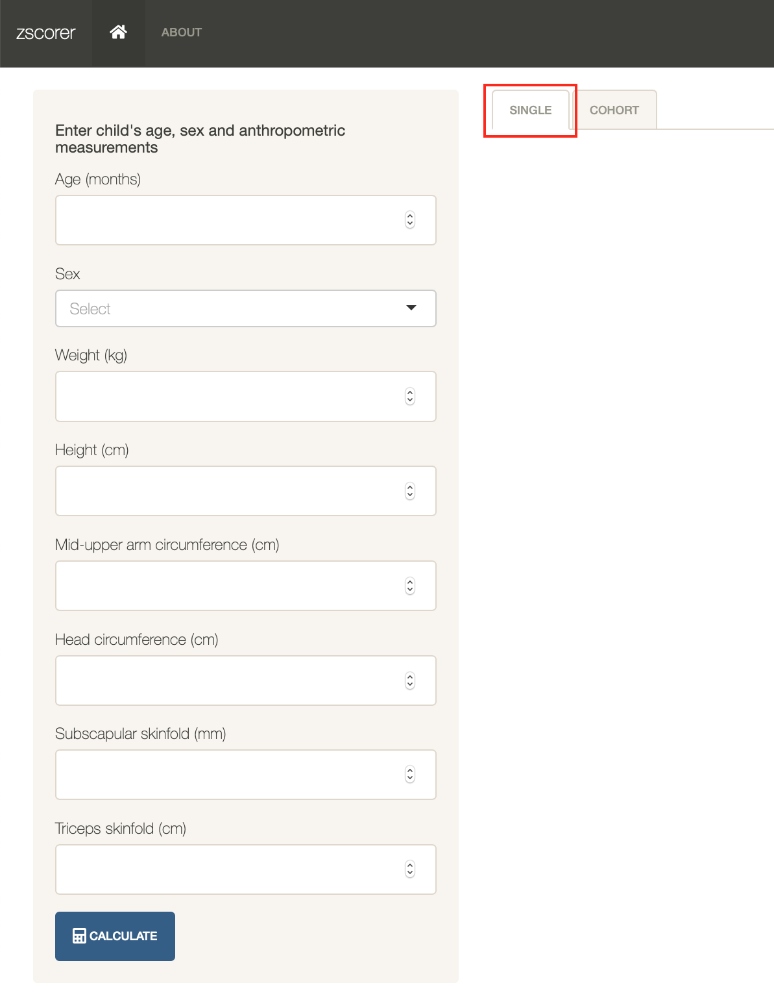
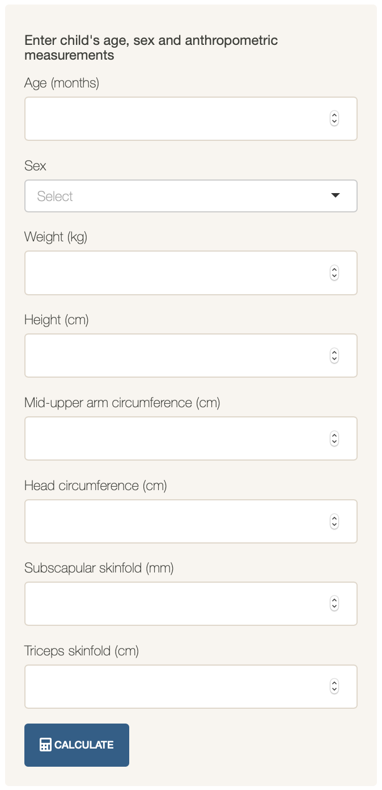
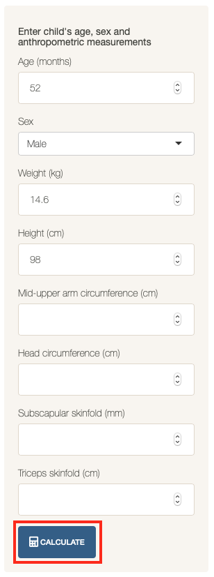
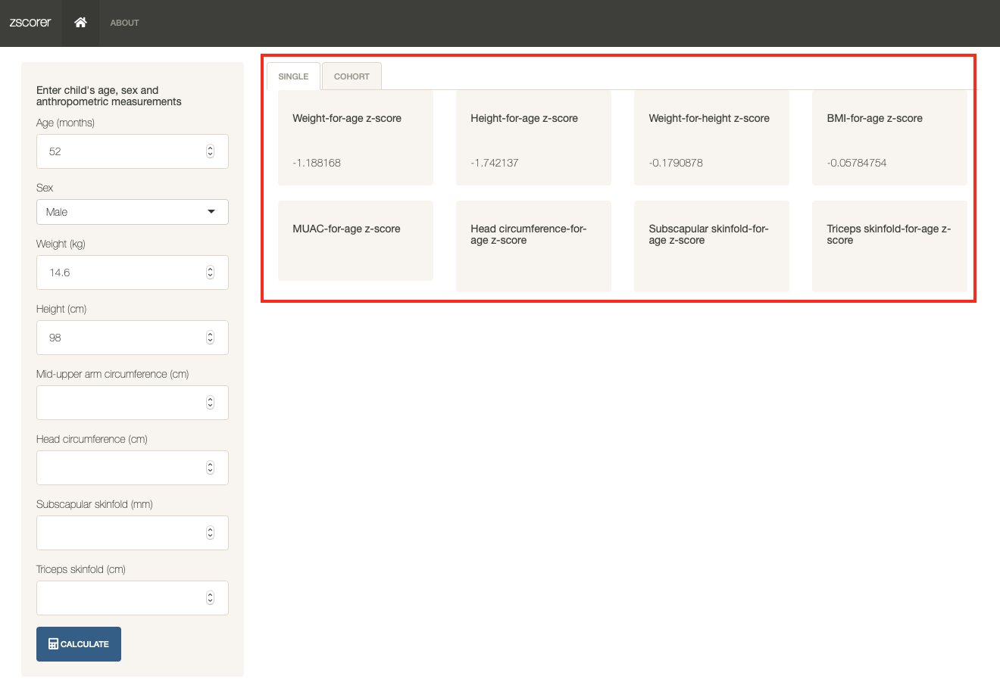
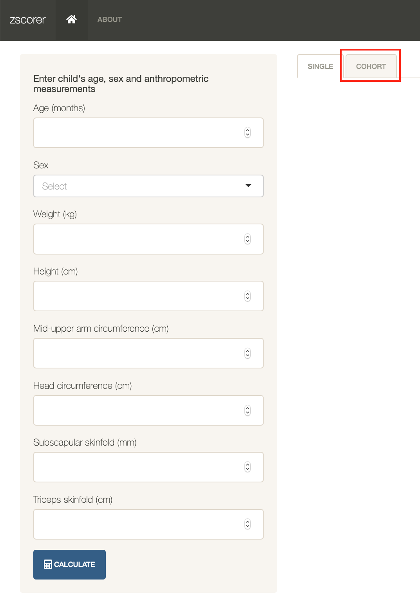
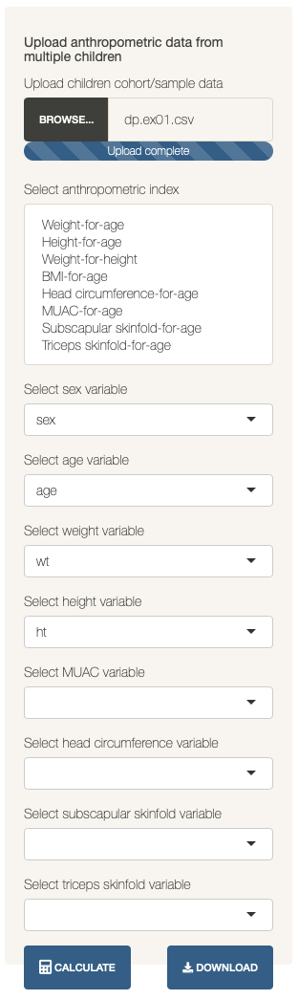
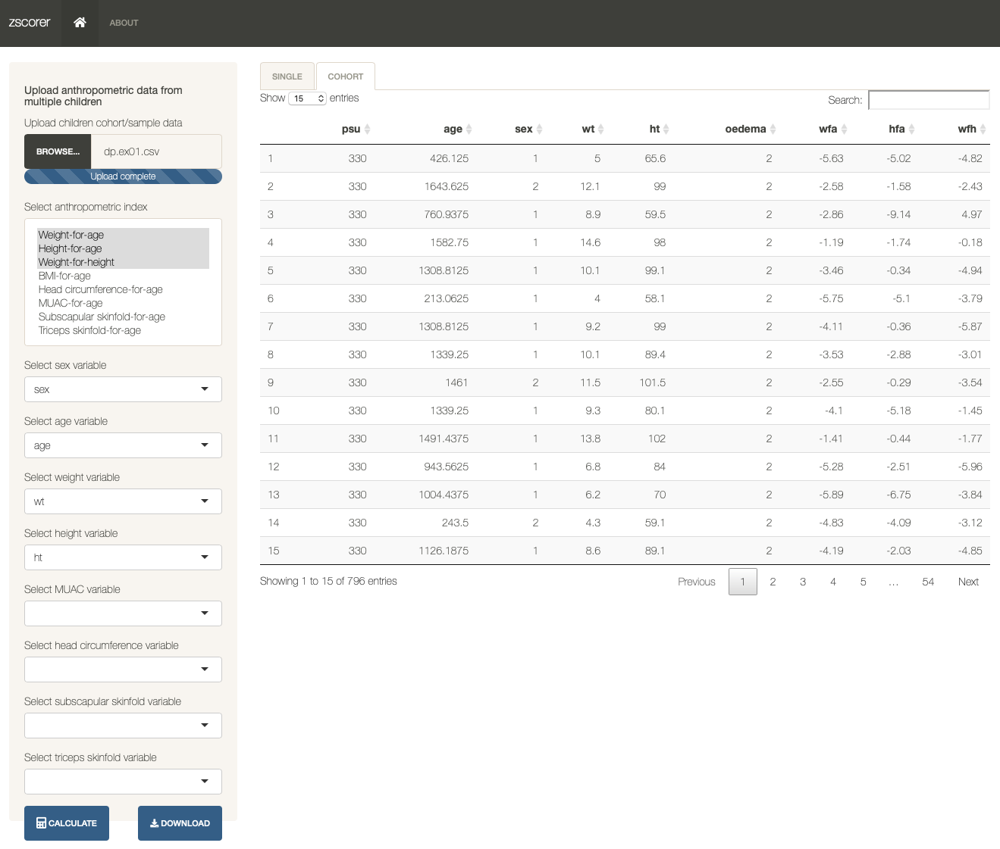

```{r, include = FALSE}
knitr::opts_chunk$set(
  collapse = TRUE,
  comment = "#>"
)

library(zscorer)
```

`zscorer` comes packaged with a built-in Shiny application. The application is initiated by issuing the following command:

```{r runApp, echo = FALSE, eval = FALSE}
run_zscorer()
```

This opens the installed web browser in the user's device showing the following:

```{r zscorerFrontpage, echo = FALSE, eval = TRUE, out.width = "90%"}
knitr::include_graphics("../man/figures/zscorerApp.png")
```

# Getting the z-score of a single child

The first (and default) functionality of the built-in Shiny application is for calculating the z-scores for a single child. This functionality is accessed by selecting the `single` option on the tabbed menu available in the top edge of the application interface as shown below:

```{r single, echo = FALSE, eval = TRUE, out.width = "30%"}

```

When this functionality is selected, the sidebar menu provides the following options:

```{r singleMenu, echo = FALSE, eval = TRUE, out.width = "30%"}

```

In this sidebar menu, the user should enter all the anthropometric measurements available for the child to whom user wants to calculate z-scores of. For the calculation to work, the minimum data needed to be supplied by the user are:

* **Age**;

* **Sex**; and,

* At least one anthropometric measurement among **weight (kgs)**, **height (cms)**, **mid-upper arm circumference (cms)**, **head circumference (cms)**, **subscapular skinfold (cms)** or **triceps skinfold (cms)**.

Please ensure that any anthropometric measurement is supplied in the appropriate units as indicated above.

To illustrate, let's use the dummy data of a **52 month** old **male** child with a weight of **14.6 kg** and a height of 
**98.0 cm**. This data is typed into the sidebar menu and then click on the `Calculate` tab as shown below:

```{r sidebarSingleInput, echo = FALSE, eval = TRUE, out.width = "30%"}

```

This produces the following output in the main panel of the application:

```{r singleResults, echo = FALSE, eval = TRUE, out.width = "90%"}

```

Depending on the anthropometric measurements supplied, the corresponding applicable z-score indices will be provided. No z-score result will be provided if the required anthropometric measurement is not supplied. In the example above, MUAC-for-age, head circumference-for-age, subscapular skinfold-for-age and triceps skinfold-for-age are not provide as no MUAC, head circumference, subscapular skinfold or triceps skinfold are provided.

# Getting the z-score of a cohort of children

The second functionality of the built-in Shiny application is for calculating the z-scores for a cohort of children. This functionality is accessed by selecting the `cohort` option on the tabbed menu available in the top edge of the application interface as shown below:

```{r cohort, echo = FALSE, eval = TRUE, out.width = "30%"}

```

When this functionality is selected, the sidebar menu provides the following options:

```{r cohortMenu, echo = FALSE, eval = TRUE, out.width = "30%"}
knitr::include_graphics("../man/figures/cohortSidebar.png")
```

In this sidebar menu, the user is expected to upload cohort data of children with their anthropometric data. The user is also expected to select which anthropometric indices to calculate. If no anthropometric indices are selected, no calculations will be performed. A cohort data can be uploaded by clicking on the `Browse` button and then selecting the file with cohort data to upload. Once uploaded, the sidebar menu will provide the following additional options:

```{r cohortOptions, echo = FALSE, eval = TRUE, out.width = "30%"}

```

For the `zscorer` app to be able to calculate z-scores from the cohort data, the variables corresponding to the required information needs to be supplied. By default, the application will search the variable names in the data and pick out typical variable names for the measurements (e.g., `ht` or `height` or `HT` or `Height` or `HEIGHT` for height measurements). If the variables are named unconventionally, user will have to select the variable name for the particular measurement from the choices. If the measurements are not in the data, then the variable field should be left empty.

Once the various parameters have been provided, user should click on the `Calculate` button which results in the following:

```{r cohortResults, echo = FALSE, eval = TRUE, out.width = "90%"}

```

The dataset provides is presented as a table in the main panel but now with additional fields for the calculated anthropometric indices. The resulting dataset with the calculated anthropometric indices can then be downloaded by clicking on the `Download` button.
